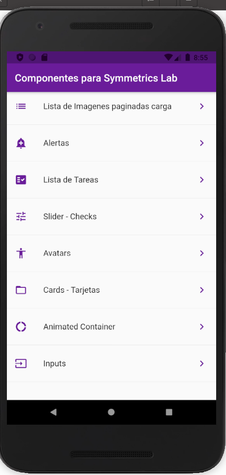
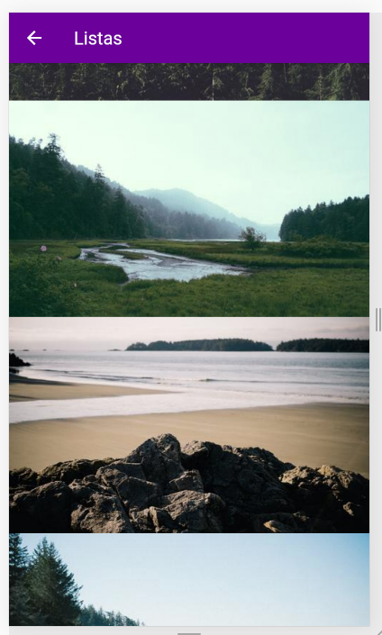
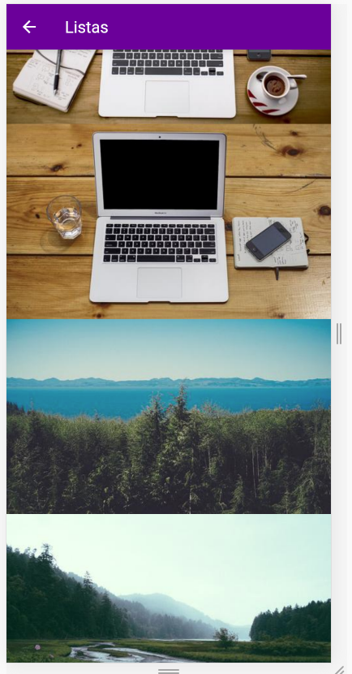
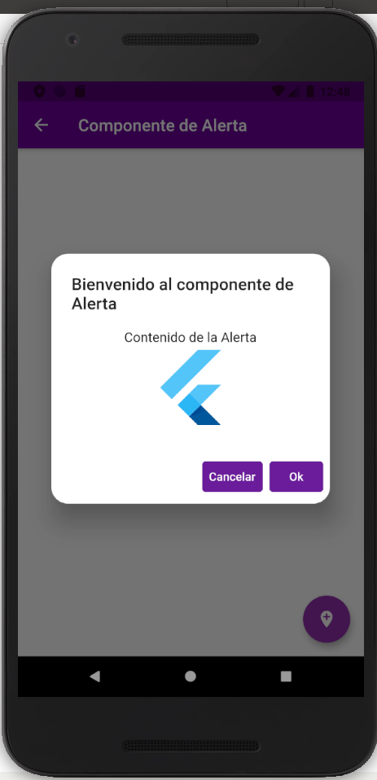
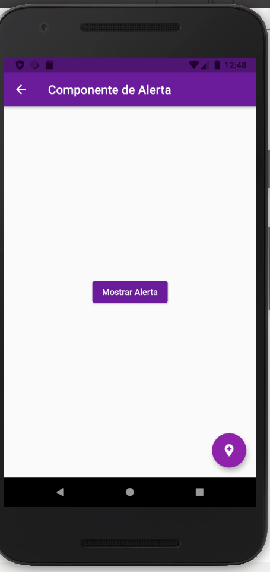
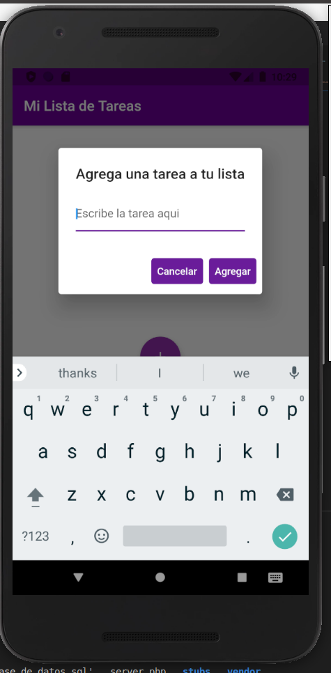
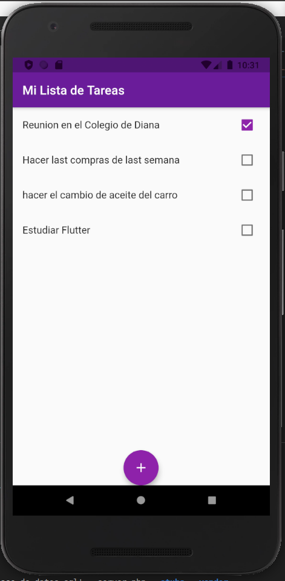
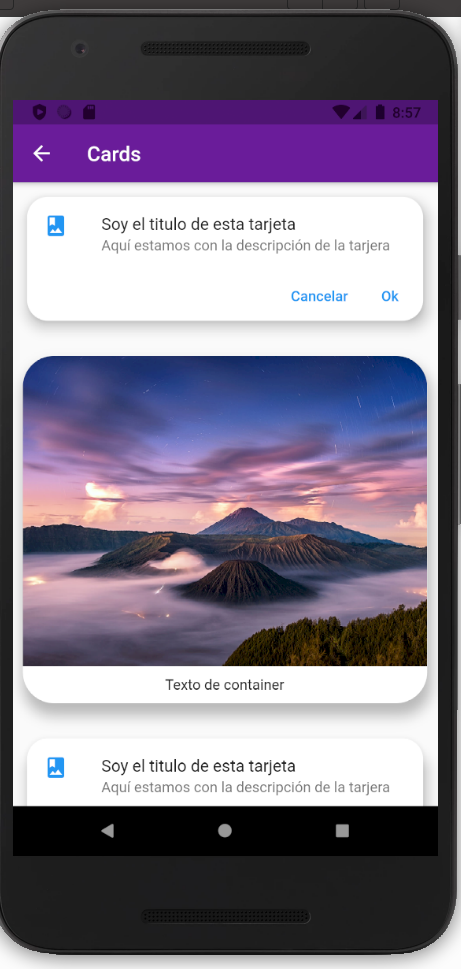
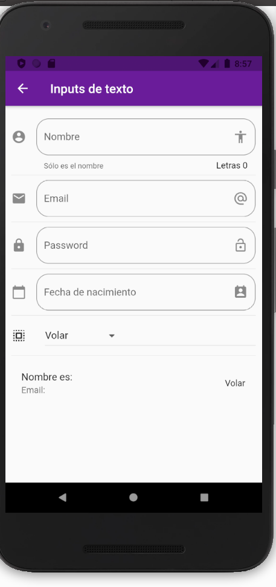
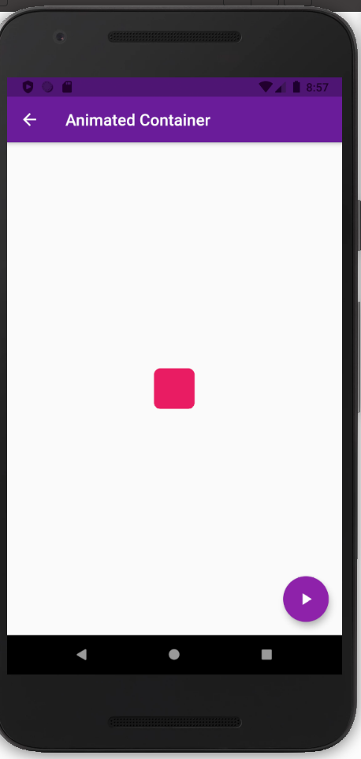

# Componentes Fluter

Componetes Flutter, Alert, Slider, Lista de tareas, Menu, Loading, Router

## How to use

Muestra la implementacion de diferentes componentes para reutilizar

## Getting Started

This project is created with [Flutter](https://flutter.dev)

## Contact

You can contact me marquezdigna83@gmail.com

## Images

